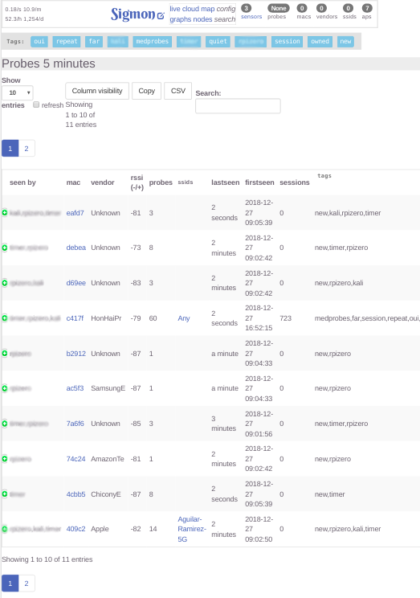
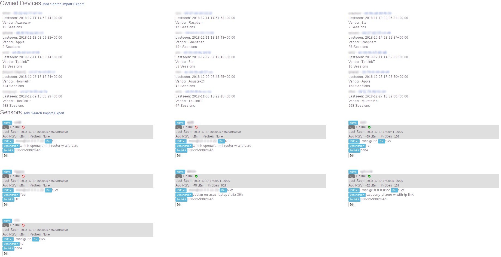

***PRELIMINARY PRE-ALPHA/NON-WORKING CODE***

## What is Sigmon?

"There will always be radios. There will only be more radios" - The Sigmon Creed

Sigmon - Signal Monitor

Original README from Oct 16 2014:

Nowadays radio waves are crowded with signals; indeed, nearly every person has a radio transmitter on them; some people have several. These transmitters are personal cellular, wireless, and bluetooth devices, and this program focuses on listening to their wireless signals.

Each time you connect to a wireless network and your device remembers the name, it indefinitally searches for it, as long as your wireless is turned on. The way it does this is by sending out 'probe' requests that contain the name of the access point you are looking for, in the form of a service set identifer (SSID). Also contained in this probe is your machine access control (MAC) address, which is completely unique to your device.

These probes are sent into the airwaves unencrypted. What this means is that anyone listening for these probes can (a) uniquely identify each device and (b) view what networks each device is looking for. This program works with that data.

Also included in this information is a relative signal strength, which can be used to determine approximate distance from the base station; with more base stations, finer granularity in location can be achieved.

While some percentage of people have smart phones, a smaller number have wireless always enabled. Even so, the number of results this program shows can be used to form a demographic map.

Other uses for this data can be discovered; at the end of this file videos are linked that include some of the wide ranging security implications.

## Screenshots

More screenshots in -[doc/screens/](doc/screens/)

## Requirements

The current stage of this code is due to change soon, but in its current form a few systems must be running to install Sigmon:

* Server: Linux machine with mongo database and python
* Sensors: Linux machine equipped wireless card(s) capable of entering Monitor Mode, which are compatible with Aircrack
  The simplest script requires only sh and tcpdump, but the more robust python client requires the libpcap-dev library as well as the 'pcapy', 'impacket', and 'py_daemon' python modules.
* Patience: A lot of stuff doesn't work and some results are incorrect

A more detailed installation guide is in the file INSTALL.

## Background

It started as a wireless probe monitor, modeled after a defcon talk featuring a
hacker who never released his implementation publically, instead only
taunting the audience with its features.

To this day I have looked at many of the public and free packages available for the tracking and recording of various personal radio transmissions, and while I'm sure that behind closed doors software that would blow our mind exists...

Sigmon is a suite designed to be powerful, reliable, and yet easy enough for the average security conscious person to immediately understand and utilize its power.

Sigmon is a dream, a crazy one which hopes to one day have a practical place among higher end security and surveillance protocols and habits.

Sigmon is a work in progress which currently has a very rudimentary proof of concept planned, as well as a very detailed map of how it could be implemented, including a number of features that other packages haven't begun to imagine.

Because of the nature of the endeavour, the back end of the software quickly becomes quite complicated - dealing with large amounts of data, across multiple platforms, in various programming languages, while configuring and maintaining fickle hardware installations - this is why Sigmon is a project that deserves a good team behind it.

Though it can technically be called spying, what is done with the information is what determines its culpability. Sigmon is designed to be set up aside other security measures, giving consciousness to the data flying around us daily.

Because it is not a fool proof system, as there are many ways to manipulate radio waves, it requires a place where security is already the standard. Yet because of its unique nature it can quickly provide insight and understanding where it is deployed, covering bases that traditional security measures will always miss.

## Design

What follows is a detailed overview of the current POC lab.

We will start with initializing the software.

On the server, it begins with a bash script which calls a couple of flask web apps in python into existence; it also starts up a rest server which gathers probes from the sensors.

The web apps provide the front end site as well as launch a few background workers that tidy up the data regularly.

The site is based on bootstrap, d3, datatables, leaflet, and uses embeddable templates written in jinja.

The web app draws its info from a mongodb server, and provides many ways of filtering, ordering, and limiting the humongous amount of data that is quickly collected.

Besides a bunch of python modules, javascript libraries, shell scripts and crontab jobs, there is also the selection and configuration of the hardware.

https://www.amazon.com/hz/wishlist/ls/20OP4JJQ0MWID

This the hardware list that I currently use. Its pretty old, but I don't know that there are many better devices - the tp-link routers might be up for replacement, as they use an older version of openwrt, and can also become unstable after some time due to its low memory. However, writing better code for the constraints could fix this - python isn't well suited for tiny systems - and these systems are kinda quirky.

The biggest factor would be power consumption - if a raspberry pi zero or even an esp8266 could perform nearly as well for much cheaper/less energy, it would make them definite target platforms.

Each worker is currently managed manually, but there are some possibilities of easily cloning, deploying, and maintaining the systems remotely.

A python script runs on the worker, which currently listens for wifi probes, but there is also a bluetooth beacon monitor. This is executed by a bash script which first configures the wireless interface and launches the script, making sure to keep it running.

The script itself syncs fairly quickly after receiving any probes or access point beacons, and also keeps a log on the device as well as sending periodic status reports to the rest server.

From there the packets get sorted into a mongodb collection, where they are soon operated on by the workers, identifying devices and establishing usage, and calculating stats as well as piecing together patterns.

These workers rely mostly on python algorithms but also make use of Mongo Javascript routines.

This information is then displayed in the dashboard. Streaming to datatables
should be possible, as well as dynamically updating the d3 charts and graphs. [x]

A Leaflet map is also in use, and will hopefully be able to overlay usage maps based on triangulation or weights. [x]

## Future

Where does it go from here?

I've identified four main areas that would need to be focused on to make Sigmon a software/commercial success.

* Programming
* Database
* Marketing
* Logistics

The number of ideas for the software is vast but a focus on the smaller pieces and a conservative outcome should make it easier to produce.

Simplifying the code and choosing the right frameworks will make the project easier to maintain and ensure stability and minimal resource usage.

With the current written plans and running software that is Sigmon beta, capable engineers should be able to reproduce this setup without extreme effort.

Devices designed to run this software and interface with various radios

Services based around managing the resulting data stores

## BUGS
Innumerable

## TODO
Total Rewrite

## Contact
CB Terry - terry.chad@gmail.com - http://github.com/terbo

## See Also
Sigmon Wiki - https://github.com/terbo/sigmon/wiki

Projects with a similar scope:

Snoopy - http://github.com/sensepost/snoopy-ng and https://github.com/sensepost/snoopy

Probr - http://probr.ch/

WiWo - https://n0where.net/802-11-massive-monitoring-wiwo/

CreepyDOL - http://blog.ussjoin.com/2013/08/creepydol.html and https://github.com/ussjoin

Kismet - https://kismetwireless.net

Videos:

http://www.youtube.com/watch?v=GvrB6S_O0BE - The Machines That Betrayed Their Masters by Glenn Wilkinson
http://www.youtube.com/watch?v=ubjuWqUE9wQ - DEFCON 21 - Stalking a City for Fun and Frivolity
http://www.youtube.com/watch?v=NjuhdKUH6U4 - DEFCON 20 - Can You Track Me Now? Government And Corporate Surveillance Of Mobile Geo-Location
